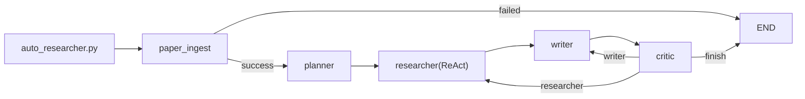

# Architecture Progressive Guide（Agent 渐进式阅读主文档）

> 本文档是项目架构解释的**唯一入口**，按 `L0 -> L1 -> L2 -> L3` 由浅入深组织。  
> 适合 agent 分段读取并按需下钻（progressive disclosure）。

## 维护约定（必须遵守）

- 所有对项目的结构性改动，必须同步记录到本文档的[附录 E 改动历史](#附录-e-改动历史按迭代维护)。
- 每次开始阅读项目代码前，优先按“先文档后代码”顺序：
  1. `L0 全局概览`（确认当前系统边界）
  2. `L1 运行路径`（确认执行链与状态流）
  3. `L2 模块地图`（定位目标模块）
  4. 再打开具体源码文件
- 若文档与代码不一致，以代码为准，并立即回写文档修正差异。

## 快速索引

- [L0 全局概览](#l0-全局概览)
- [L1 运行路径](#l1-运行路径)
- [L2 模块地图](#l2-模块地图)
- [L3 节点深潜](#l3-节点深潜)
- [附录 A State 字段字典](#附录-a-state-字段字典)
- [附录 B ReAct 与 Critic 判定语义](#附录-b-react-与-critic-判定语义)
- [附录 C RAG 设计与限制](#附录-c-rag-设计与限制)
- [附录 D MCP 接入契约](#附录-d-mcp-接入契约)
- [附录 E 改动历史（按迭代维护）](#附录-e-改动历史按迭代维护)
- [按问题跳转](#按问题跳转)

---

## L0 全局概览

### 一句话目标
把“读取论文 -> 证据提取 -> 写作 -> 审稿 -> 修订”做成可追踪、可回路的研究工作流（research workflow）。

### 功能模式（并列能力）
- `single_paper`：分析单篇论文（PDF + MCP + RAG补充）。
- `topic_synthesis`：不依赖单篇输入，直接基于本地RAG语料库总结方向切入点。

### 系统边界
- 输入：一篇 PDF（本地路径）+ 用户 query。
- 输出：最终报告 markdown（含计划、证据轨迹、草稿、审稿结论）。
- 外部依赖：LLM API、`pdf-reader-mcp`、本地向量库 Chroma。

### 主流程图（高层）	



---

## L1 运行路径

### 执行链
`auto_researcher.py` 负责：
1. 解析 CLI 参数（`mode + query + paper_path(optional)`）。
2. 构建初始 `AgentState`。
3. 调用 `workflow.app.stream(...)` 逐节点执行。
4. 汇总状态并写出最终报告到 `outputs/`。

### 关键状态流（state flow）
- `paper_ingest` 写入：`input_paper_*`（标题、摘要、sections、parse_status）
- `planner` 写入：`plan` + `plan_structured`
- `researcher` 写入：`evidence_cards`、`react_trace`、`rag_context`
- `writer` 写入：`writer_structured_draft`、`writer_claims`、`draft`
- `critic` 写入：`critic_status`、`critic_next_step`、`hard/soft_failed_gates`、`critic_actions_*`

### 路由语义
- ingest 失败：直接 `END`（fail-fast）
- critic 决策：
  - `researcher`：补证据
  - `writer`：改表达/结构
  - `finish`：结束（包括通过和带风险结束）

说明：
- `single_paper`：`paper_ingest` 真实解析 PDF。
- `topic_synthesis`：`paper_ingest` 跳过单篇解析并直接进入规划。

### 代码阅读建议路径（按问题下钻）
- CLI/报告输出问题：先看 `auto_researcher.py`，再看 `workflow.py`
- 论文读取/MCP 问题：先看 `paper_parser.py`，再看 `nodes_ingest_planner.py`
- 取证/ReAct 问题：先看 `nodes_researcher.py`（兼容入口在 `nodes.py`）
- 写作质量问题：先看 `nodes_writer.py`
- 审稿/路由问题：先看 `nodes_critic.py`
- RAG 入库/检索问题：先看 `rag.py`，批量操作再看 `scripts/db_manager.py`

---

## L2 模块地图

> 模板：`用途 | 输入 | 输出 | 关键状态字段 | 失败与降级 | 调试入口`

## `config.py`
- 用途：集中读取 `.env`，提供运行参数和 LLM 工厂。
- 输入：环境变量。
- 输出：常量（如 `MAX_REVISIONS`, `RAG_TOP_K`）和 `get_llm()`。
- 关键状态字段：无（配置层）。
- 失败与降级：缺失 API key 时会在节点调用 LLM 时报错。
- 调试入口：打印 `.env` 生效值，确认模型与 base_url。

## `state.py`
- 用途：定义统一 `AgentState`（短期记忆 short-term memory）。
- 输入：`build_initial_state(query, paper_path, ...)`。
- 输出：流程共享状态字典。
- 关键状态字段：`plan_*`、`evidence_cards`、`critic_*`、`react_*`、`input_paper_*`。
- 失败与降级：字段缺失会导致节点 prompt 或路由异常。
- 调试入口：查看每节点 `state_update` 与最终报告字段是否齐全。

## `workflow.py`
- 用途：LangGraph 编排图，定义节点和边。
- 输入：`AgentState`。
- 输出：节点执行流与路由结果。
- 关键状态字段：`revision_number`、`critic_next_step`。
- 失败与降级：路由条件异常会提前 `END` 或循环错误。
- 调试入口：核对入口节点、条件边映射、修订上限逻辑。

## `paper_parser.py`
- 用途：MCP client + 适配层（adapter），把 MCP 返回统一成 `PaperDocument`。
- 输入：`paper_path`、capability 名称。
- 输出：`PaperDocument` 或 `CapabilityResult`。
- 关键状态字段：`input_paper_parse_status`、`input_paper_parse_notes`。
- 失败与降级：MCP 连接失败/工具缺失 -> `parse_status=failed`。
- 调试入口：`parse_notes`、MCP URL、工具能力别名解析。

## `tools.py`
- 用途：researcher 可调用工具集合（PDF 解析能力 + RAG 检索）。
- 输入：`paper_path` 或 `query`。
- 输出：统一字符串（成功内容 / `[MCP_ERROR]` / `[MCP_WARN]`）。
- 关键状态字段：通过 `researcher` 写入 `searched_queries`、`evidence_cards`。
- 失败与降级：错误结果不进入证据池。
- 调试入口：看工具调用轨迹和错误前缀。

## `rag.py`
- 用途：本地向量检索（Chroma）与入库切块。
- 输入：paper payload（标题、摘要、sections、全文）。
- 输出：`upsert` 入库、`retrieve` 命中片段。
- 关键状态字段：`retrieved_papers`、`rag_context`。
- 失败与降级：依赖缺失或 embedding 失败时返回 `[RAG_ERROR]`。
- 调试入口：collection 计数、命中分数、metadata 完整性。

## `nodes_*` 与 `nodes.py`（兼容层）
- 用途：节点职责拆分；`nodes.py` 提供旧导入路径兼容导出。
- 输入：`AgentState`。
- 输出：每节点 `state_update`。
- 关键状态字段：几乎所有核心业务字段。
- 失败与降级：节点内异常由 fallback 分支处理（尤其 critic）。
- 调试入口：节点日志 + 最终报告对应区块。

---

## L3 节点深潜

## 1) `paper_ingest`
- 用途：读取并结构化当前论文。
- 输入：`paper_path`。
- 输出：`input_paper_title/abstract/sections/key_sections/parse_status`。
- 关键状态字段：`input_paper_parse_status` 决定是否继续。
- 失败与降级：`failed` 直接结束流程。
- 调试入口：`input_paper_parse_notes`。

## 2) `planner`
- 用途：将研究任务拆分为 3-4 个可执行步骤。
- 输入：`query` + 当前论文结构化内容。
- 输出：`plan`（可读）+ `plan_structured`（结构化）。
- 关键状态字段：`plan_structured` 被 researcher/writer 直接消费。
- 失败与降级：LLM 异常时返回空计划。
- 调试入口：检查每个 step 是否包含 `goal/required_evidence/deliverable`。

## 3) `researcher`（ReAct）
- 用途：按 Thought-Action-Observation 多步取证。
- 输入：计划、critic 对 researcher 的动作建议、论文内容、可用工具集。
- 输出：`evidence_cards`、`react_trace`、`react_stop_reason`、`rag_context`。
- 关键状态字段：
  - `react_step_count`
  - `react_stop_reason`
  - `searched_queries`
  - `evidence_gaps`
- 失败与降级：
  - 工具错误过多停止；
  - 无证据时启用默认回退工具；
  - 仍无证据会标记缺口并继续流程。
- 调试入口：`Researcher ReAct 轨迹` 区块。

## 4) `writer`
- 用途：双轨写作（结构化核验稿 + 可读长文稿）。
- 输入：`plan_structured`、`evidence_cards`、critic 给 writer 的动作建议。
- 输出：`writer_structured_draft`、`writer_claims`、`draft`。
- 关键状态字段：`writer_claims` 用于 critic 的覆盖率与证据对齐核验。
- 失败与降级：LLM 解析失败时会退化到基础文本策略（保持流程不崩）。
- 调试入口：检查 claim 是否绑定 evidence id / goal id。

## 5) `critic`
- 用途：门槛化审稿（hard gate + soft gate）并决定下一步。
- 输入：`draft`、`writer_claims`、`evidence_cards`、按需上下文。
- 输出：
  - `critic_status`: `pass | pass_with_warnings | fail | finish_with_risks`
  - `critic_next_step`: `writer | researcher | finish`
  - `hard_failed_gates` / `soft_failed_gates`
  - `critic_actions_for_researcher` / `critic_actions_for_writer`
- 关键状态字段：`blocked_by_capability`、`unresolved_gaps`。
- 失败与降级：critic 运行错误走兜底状态，避免流程崩溃。
- 调试入口：最终报告中的 `Critic 总结 / 警告 / 建议 / 未解决硬缺口`。

---

## 附录 A State 字段字典

## A1 输入论文生命周期
- `paper_path`: 当前处理论文路径
- `input_paper_title`
- `input_paper_abstract`
- `input_paper_sections`
- `input_paper_key_sections`
- `input_paper_parse_status`
- `input_paper_parse_notes`

## A2 证据生命周期
- `documents`: writer 可直接消费的证据文本
- `evidence_cards`: 结构化证据卡（id/source/goal/snippet）
- `retrieved_papers`: RAG 命中原片段
- `rag_context`: 聚合 RAG 上下文

## A3 写作与审稿生命周期
- `writer_structured_draft`
- `writer_claims`
- `draft`
- `critic`
- `critic_status`
- `critic_next_step`
- `critic_scores`
- `critic_actions_*`

## A4 反思与路由生命周期
- `revision_number`
- `revision_history`
- `react_trace`
- `react_stop_reason`
- `evidence_gaps`
- `unresolved_gaps`
- `blocked_by_capability`

---

## 附录 B ReAct 与 Critic 判定语义

## B1 ReAct 常见停止原因（`react_stop_reason`）
- `model_declared_final`: 模型认为证据足够
- `repeated_signature`: 重复工具签名
- `low_information_gain`: 连续低增益
- `too_many_tool_errors`: 工具错误过多
- `priority_queue_exhausted`: 队列已覆盖且无新信息
- `max_steps_reached`: 达到步数上限

### 最小示例（日志片段）
```text
step-4 action: extract_key_sections_tool ...
step-4 observation: ... novelty=0.03
step-5 stop: low_information_gain
```

## B2 Critic 门槛分层
- 硬门槛（hard gate）：不过会阻塞通过，例如 `no_hallucination`。
- 软门槛（soft gate）：不过给警告和动作建议，不一定阻塞结束。

## B3 结束态语义
- `pass`: 通过
- `pass_with_warnings`: 通过但有建议
- `fail`: 未通过，继续修订
- `finish_with_risks`: 到达上限后带风险结束（不等于合格）

---

## 附录 C RAG 设计与限制

## C1 入库设计
- 切块：`RecursiveCharacterTextSplitter`
- metadata：`paper_id/title/source_path/section/chunk_index`
- 去重：同论文 chunk hash 去重

## C2 检索设计
- 当前为 dense similarity（Chroma + embedding）
- 查询会拼接当前论文上下文（前 1500 字）增强任务相关性

## C3 当前限制
- 主要是纯相似度检索，对关键词精确匹配较弱
- 尚未做 hybrid（BM25）和 rerank，命中质量仍有提升空间

### 最小示例（命中格式）
```text
[RAG#1] score=0.73 title=... section=method source=...
snippet...
```

---

## 附录 D MCP 接入契约

## D1 能力名约定（支持 `-` / `_` 别名）
- `extract-academic-text`
- `extract-abstract`
- `detect-sections`
- `extract-key-sections`
- `extract-citations`

## D2 错误语义
- 工具层统一前缀：
  - `[MCP_ERROR] ...`
  - `[MCP_WARN] ...`
- researcher 不会把 error/warn 直接写入证据池。

## D3 fail-fast 行为
- ingest 解析失败 -> workflow 直接 `END`，防止“无论文证据继续写作”。

### 典型错误示例
```text
MCP parse error: ExceptionGroup: unhandled errors in a TaskGroup ...
```

---

## 附录 E 改动历史（按迭代维护）

> 说明：本节记录“影响架构/流程/契约”的改动，不记录纯格式微调。

### E1. 基线闭环建立（planner -> researcher -> writer -> critic）
- 建立 LangGraph 主流程与修订循环。
- 增加 `paper_ingest` 作为入口节点，解析失败直接终止（fail-fast）。

### E2. PDF-MCP 全链路接入
- `paper_parser.py` 作为 MCP client + adapter，统一解析 `content/structuredContent/text`。
- 标准化 5 类能力：`extract-academic-text / extract-abstract / detect-sections / extract-key-sections / extract-citations`。
- 增加工具别名兼容（`-` 与 `_`）。

### E3. 研究工具重构（去联网搜索，转论文内证据）
- 移除 DuckDuckGo 搜索路径。
- researcher 改为优先调用 PDF-MCP 工具，RAG 作为本地文献补充。
- 工具错误与空结果不再污染 `documents` 证据池。

### E4. RAG 落地（Chroma）
- `rag.py` 提供入库 `upsert_paper_to_vector_db` 与检索 `retrieve_related_papers`。
- 切块策略：`RecursiveCharacterTextSplitter` + chunk hash 去重。
- 元数据策略：`paper_id/title/source_path/section/chunk_index`，支持来源追踪。
- 增加 `scripts/db_manager.py`，统一 `ingest/search/list/stats/delete/clear`。

### E5. Researcher ReAct 化与止损
- researcher 从单次调用改为多步 `Thought -> Action -> Observation`。
- 增加 `react_trace / react_step_count / react_stop_reason` 可观测字段。
- 加入重复动作、低信息增益、错误阈值等停止规则，降低无效循环。

### E6. Critic 门槛化与结束语义修复
- 引入硬门槛/软门槛分级，区分阻塞失败与改进建议。
- 统一结束态：`pass | pass_with_warnings | fail | finish_with_risks`。
- 增加能力阻塞通道 `blocked_by_capability`，避免能力缺失被误判为写作失败。
- 建议分流为 `critic_actions_for_researcher` 与 `critic_actions_for_writer`。

### E7. 节点模块化重构（第二轮）
- 拆分节点实现为 `nodes_common / nodes_ingest_planner / nodes_researcher / nodes_writer / nodes_critic`。
- 保留 `nodes.py` 兼容导出层，确保 `workflow` 与外部调用不破坏。

### E8. 文档体系重构
- 新增本主文档，采用 `L0-L3 + 附录` 渐进式结构。
- README 增加主文档入口，作为“先读文档再读代码”的默认路径。

### E9. 最近改动（当前迭代）
- `auto_researcher.py` 增加可选参数 `--add-to-rag {y,n}`（默认 `n`），支持运行后按状态将当前论文入库。
- 最终报告头部新增 `RAG入库状态`。
- `paper_parser.py` 增加“从 MCP 全文抽取论文标题”逻辑，输出标题优先使用解析标题，失败才回退文件名。
- `nodes_impl.py` 在 `writer_node` 增加标题后处理：无论模型如何生成，最终草稿中的“论文题目”行都会强制对齐 `input_paper_title`。

### E10. 新增并列功能：`topic_synthesis`
- `AgentState` 增加 `mode` 字段，支持 `single_paper | topic_synthesis`。
- `auto_researcher.py` 增加 `--mode` 参数：
  - `single_paper` 必须传入 `paper_path`
  - `topic_synthesis` 可不传 `paper_path`
- `paper_ingest_node` 在 `topic_synthesis` 下跳过单篇解析，避免错误阻塞。
- `researcher_node` 增加方向综述分支：
  - 先调用 `rag_corpus_overview_tool` 获取语料全局覆盖
  - 再按固定切入轴调用 `rag_search_tool` 聚合证据
- `writer_node` 增加方向综述写作分支（输出“主要切入点 + 方向地图 + future directions”）。
- `critic_node` 增加方向综述审稿分支，核心检查“跨论文覆盖度（unique_titles）+证据标注密度”。

---

## 按问题跳转

- 如何判断“为什么未通过审稿”？  
  先看 [B2 Critic 门槛分层](#b2-critic-门槛分层) 与 [L3-5 critic](#5-critic)。

- ReAct 为什么停止？  
  看 [B1 ReAct 常见停止原因](#b1-react-常见停止原因react_stop_reason)。

- Goal-9 为什么有时是硬门槛，有时是软门槛？  
  看 [L3-5 critic](#5-critic) 与 `blocked_by_capability` 字段。

- 证据是从哪里来的？  
  看 [L2 模块地图](#l2-模块地图) 中 `tools.py / rag.py / paper_parser.py`。

---

## 扩展阅读

- 安装与排错：[`docs/pdf_reader_mcp_setup.md`](./pdf_reader_mcp_setup.md)
- 面试表达模板：[`docs/mas_interview_qa.md`](./mas_interview_qa.md)
- 输出约束源文档：[`agent要求.md`](../agent要求.md)
