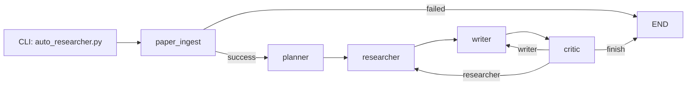

# Lygent Auto Researcher

一个基于 LangGraph 的研究型 Agent 项目，目标是围绕“教育模拟 + 多智能体 + 社会行为机制”完成从论文读取、研究规划、检索、写作到批判反思的闭环。

当前版本重点是：
- 通过 `pdf-reader-mcp` 读取 PDF 论文并结构化入状态。
- 运行 `planner -> researcher -> writer -> critic` 的反思循环。
- 使用 `Chroma` 构建本地向量数据库，并通过 `rag.py` 做召回。

## 项目目标

这个项目不是普通摘要器，而是“研究推进助手”：
- 先细读当前输入论文。
- 再结合论文内证据抽取与本地论文库相关内容（Chroma RAG）。
- 最后输出可执行的研究判断与 future research insight。

固定输出要求由 [agent要求.md](./agent要求.md) 驱动，`writer` 和 `critic` 都会显式消费该文档。

## 当前能力边界

已实现：
- PDF 通过 MCP 解析并写入状态。
- 规划、检索、写作、审稿、回路反思。
- researcher 阶段通过 5 个 PDF-MCP 工具抽取论文证据（无联网搜索）。
- ingest 失败时 fail-fast（不继续胡写）。

未完全实现：
- 长期记忆存储（目前以内存 state 为主）。

## 技术栈

- Python 3.10+
- LangChain / LangGraph
- Pydantic v2
- MCP Python SDK
- Chroma + HuggingFace Embeddings（RAG）

依赖定义见 [pyproject.toml](./pyproject.toml)。

## 项目结构

```text
Lygent/
├─ auto_researcher.py                # CLI 入口：传入论文路径并启动 workflow
├─ agent要求.md                      # 最终输出规范（writer/critic 的核心约束）
├─ docs/
│  └─ pdf_reader_mcp_setup.md        # MCP 启动与排错文档
├─ mcps/
│  └─ pdf-reader-mcp/                # 本地 PDF MCP server
└─ research_agent/
   ├─ config.py                      # 环境变量、LLM 工厂、全局配置
   ├─ state.py                       # AgentState 定义与初始状态
   ├─ schemas.py                     # Planner/Critic 结构化输出 schema
   ├─ paper_parser.py                # MCP client + 解析适配层（核心）
   ├─ rag.py                         # Chroma RAG 入库与检索
   ├─ tools.py                       # researcher 可调用的 PDF-MCP 工具
   ├─ nodes.py                       # paper_ingest/planner/researcher/writer/critic
   └─ workflow.py                    # LangGraph 编排与路由
```

## 整体工作流



关键机制：
- `paper_ingest` 失败直接结束。
- `critic` 决定下一步去 `writer` 还是 `researcher`。
- `MAX_REVISIONS` 限制循环次数，防止无限反复。

## 关键模块说明

### 1) paper_parser（MCP 适配层）

[research_agent/paper_parser.py](./research_agent/paper_parser.py)

职责：
- 连接 MCP server（SSE）。
- 检查所需工具是否存在（支持 `-` / `_` 命名别名）。
- 调用 PDF 相关 MCP 工具并统一解析输出。
- 归一化 section/key-section 字段。
- 返回统一 `PaperDocument`，并给 `success/partial/failed` 状态。

它本质是 client + adapter：
- client：`list_tools` / `call_tool`
- adapter：把 MCP 原始返回变成你系统可消费字段

### 2) State（短期记忆与流程上下文）

[research_agent/state.py](./research_agent/state.py)

核心字段：
- 任务与流程：`query`, `plan`, `current_step`, `revision_number`
- 论文输入：`paper_path`, `input_paper_*`
- 外部证据：`documents`, `retrieved_papers`, `rag_context`
- 反思记忆：`critic`, `critic_next_step`, `revision_history`, `evidence_gaps`, `working_memory`

### 3) Nodes（业务节点）

[research_agent/nodes.py](./research_agent/nodes.py)

- `paper_ingest_node`：读 PDF 并写回 state
- `planner_node`：基于当前论文拆分 3-4 步计划
- `researcher_node`：调用 PDF-MCP 工具提取论文证据 + Chroma RAG 召回
  - 仅将成功工具输出写入 `documents` 作为证据池，工具错误/空内容不会进入证据文档
- `writer_node`：按 `agent要求.md` 生成研究分析草稿
- `critic_node`：结构化审稿并决定下一跳

### 4) Workflow（路由与反思闭环）

[research_agent/workflow.py](./research_agent/workflow.py)

- 入口：`paper_ingest`
- 失败终止：`paper_ingest_router -> END`
- 反思路由：`critic -> (writer | researcher | END)`

## 运行前准备

### 1) 安装依赖

```bash
cd /Users/a/Documents/Program/Lygent
uv sync
```

### 2) 准备 `.env`

最少需要：

```env
# LLM
DASHSCOPE_API_KEY=...
DASHSCOPE_API_BASE_URL=...
DASHSCOPE_MODEL=qwen-plus

# MCP
PDF_READER_MCP_SSE_URL=http://localhost:8000/sse
PDF_PARSE_TIMEOUT_SEC=60

# 可选
MAX_REVISIONS=2
RAG_TOP_K=5
RAG_CHUNK_SIZE=1200
RAG_CHUNK_OVERLAP=200
VECTOR_DB_DIR=./data/vector_db
VECTOR_DB_COLLECTION=papers
EMBEDDING_MODEL=BAAI/bge-m3
```

### 3) 启动 PDF MCP server

```bash
cd /Users/a/Documents/Program/Lygent/mcps/pdf-reader-mcp
uv run pdf-reader
```

## 如何运行

```bash
cd /Users/a/Documents/Program/Lygent
.venv/bin/python auto_researcher.py "/absolute/path/to/paper.pdf"
```

说明：
- 当前 CLI 采用“位置参数传论文路径”。
- `--query` 仍可选，用于覆盖默认研究问题。

## 常见问题排查

### 1) `paper_path is empty`

没有传文件路径。请在命令后追加 PDF 路径。

### 2) `Only PDF is supported in paper_parser`

传入文件不是 `.pdf`。

### 3) `MCP parse error: ExceptionGroup...`

通常先看根因是否是代理环境：
- 如果你开了 `all_proxy/http_proxy/https_proxy` 且缺少 `socksio`，会导致本地 `localhost` MCP 连接失败。
- 可临时关闭代理后运行：

```bash
env -u all_proxy -u http_proxy -u https_proxy NO_PROXY=localhost,127.0.0.1 \
.venv/bin/python auto_researcher.py "/absolute/path/to/paper.pdf"
```

### 4) `MCP connected, but required capabilities missing`

当前 MCP server 暴露工具名与期望不一致。  
本项目已兼容 `extract-academic-text` 与 `extract_academic_text` 双命名，但若能力本身缺失仍会失败。

## RAG 与数据库接入点

当前 RAG 已落地到 Chroma，入口在：
- [research_agent/rag.py](./research_agent/rag.py)

核心函数：
- `upsert_paper_to_vector_db(...)`：将论文切块后写入 Chroma
- `retrieve_related_papers(...)`：向量检索返回相关文献片段

### 批量入库工具（调用 pdf-reader-mcp）

新增脚本：`scripts/ingest_papers.py`  
功能：支持本地 PDF、目录、URL 链接、txt 列表（每行一个路径或链接）自动解析并入库。

先启动 MCP：
```bash
cd /Users/a/Documents/Program/Lygent/mcps/pdf-reader-mcp
uv run pdf-reader
```

再执行入库：
```bash
cd /Users/a/Documents/Program/Lygent
.venv/bin/python scripts/ingest_papers.py \
  "/absolute/path/to/paper1.pdf" \
  "https://arxiv.org/pdf/1706.03762.pdf"
```

目录批量入库：
```bash
.venv/bin/python scripts/ingest_papers.py "/absolute/path/to/pdf_dir" --recursive
```

入库后检索验证：
```bash
.venv/bin/python scripts/ingest_papers.py "/absolute/path/to/pdf_dir" --recursive \
  --query "multi-agent education simulation" --top-k 5
```

## 开发建议（下一步）

建议按以下顺序继续：
1. 将 `paper_parser` 拆为多 MCP adapter（每个 MCP 一个 client 文件）。
2. 在 `critic` 增加更细粒度评分字段（证据密度、迁移价值、实验有效性）。
3. 增加单元测试与集成测试（重点覆盖 ingest 失败路径与反思路由）。
4. 根据你需求可替换 Chroma 为 pgvector/sqlite-vec，保持 `rag.py` 接口不变。

## 参考文档

- PDF MCP 安装与运行：[docs/pdf_reader_mcp_setup.md](./docs/pdf_reader_mcp_setup.md)
- 输出规范与研究目标：[agent要求.md](./agent要求.md)
